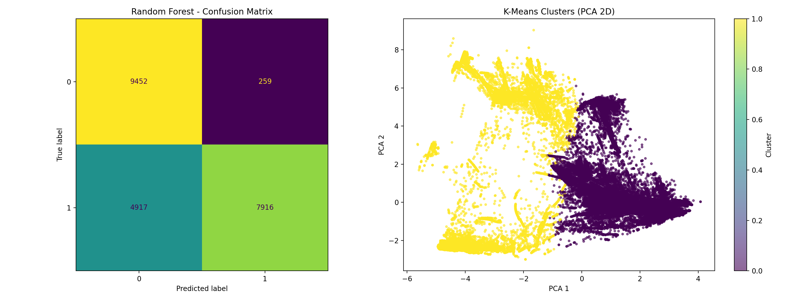
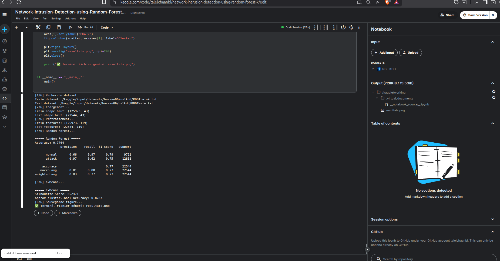

# Rapport de projet — Détection d’intrusion réseau (IDS)

## 1) Informations générales
- **Réalisé par** : Talel Chaanbi et Mehdi Gattoussi  
- **Groupe** : M1_SSII_FAD  
- **Date** : 19/03/2026

---

## 2) Résumé
On va utiliser ce dataset pour la **classification** des attaques  d'une part et pour la **detection des anomalies** d'autre part. Nous allons donc utiliser une approche **supervisée** (Random Forest) pour la classification et une approche **non supervisée** (K-Means) pour la détection d’intrusions dans le dataset NSL-KDD.

---

## 3) Contexte et problématique
Un IDS (Intrusion Detection System) analyse le trafic réseau afin d’identifier les comportements malveillants. Dans un contexte réel, un bon IDS doit :

- détecter un maximum d’attaques (haut **recall** sur la classe attaque),
- limiter les fausses alertes,
- rester robuste et interprétable.

L’objectif de ce travail est de comparer :

1. un classifieur supervisé (`RandomForestClassifier`) ;
2. un algorithme de clustering (`KMeans`) pour l’analyse non supervisée.

---

## 4) Dataset
- **Nom** : NSL-KDD  
- **Source** : Kaggle  
- **Description** : trafic réseau avec caractéristiques de connexion et labels d’attaque.

### Fichiers utilisés

- `KDDTrain+.txt` : **125973** lignes, **43** colonnes  
- `KDDTest+.txt` : **22544** lignes, **43** colonnes

Le dataset NSL-KDD est une version améliorée de KDD’99 (moins de redondance, meilleure qualité d’évaluation).

---

## 5) Méthodologie

### 5.1 Prétraitement des données

1. Conversion du label en binaire :
   - `normal -> 0`
   - `attack -> 1`
2. Suppression des colonnes non utilisées comme features (`label`, `difficulty`).
3. Encodage des variables catégorielles (one-hot encoding).
4. Alignement des colonnes entre train et test après encodage.
5. Standardisation (`StandardScaler`) pour K-Means.

### 5.2 Modèles entraînés
#### A) Random Forest (supervisé)

- `n_estimators=250`
- `class_weight="balanced_subsample"`
- `random_state=42`
- Évaluation sur le **test officiel** NSL-KDD

#### B) K-Means (non supervisé)

- `n_clusters=2`
- `n_init=10`
- `random_state=42`
- Évaluation via **silhouette score** + mapping indicatif cluster→label

---

## 6) Résultats expérimentaux

### 6.1 Random Forest
- **Accuracy** : **0.7704**

| Classe | Precision | Recall | F1-score | Support |
|---|---:|---:|---:|---:|
| normal | 0.66 | 0.97 | 0.79 | 9711 |
| attack | 0.97 | 0.62 | 0.75 | 12833 |

- **Macro F1** : 0.77  
- **Weighted F1** : 0.77

### 6.2 K-Means
- **Silhouette Score** : **0.2471**
- **Accuracy approximative cluster→label** : **0.8787** (indicative)

> Remarque : l’accuracy cluster→label n’est pas une métrique supervisée standard, elle sert uniquement d’indication qualitative.

---

## 7) Analyse et discussion
1. Le modèle `RandomForestClassifier` donne une performance globale correcte sur NSL-KDD.
2. La classe `normal` présente un rappel très élevé (0.97), ce qui montre une bonne reconnaissance du trafic légitime.
3. Le rappel de la classe `attack` (0.62) indique qu’une partie des attaques n’est pas détectée ; c’est le principal axe d’amélioration.
4. `KMeans` fournit une séparation partielle des comportements réseau (silhouette modérée), utile en phase exploratoire, mais insuffisante seule pour un IDS opérationnel.

---

## 8) Figures

### Figure 1 — Résultats du modèle

### Figure 2 — Capture Kaggle

---

## 9) Conclusion
Ce projet confirme que l’approche **supervisée** est la plus adaptée pour la classification d’intrusions sur NSL-KDD. `RandomForestClassifier` fournit un compromis solide entre performance et robustesse. L’approche **non supervisée** par `KMeans` reste intéressante pour l’exploration d’anomalies mais ne remplace pas un classifieur supervisé dans un cadre de détection final.

---

## 10) Perspectives d’amélioration

- Optimisation des hyperparamètres (`GridSearchCV`, `RandomizedSearchCV`) ;
- amélioration du rappel sur la classe attaque (gestion du déséquilibre, seuil de décision) ;
- comparaison avec des modèles avancés (XGBoost, LightGBM, réseaux de neurones) ;
- extension vers un pipeline de détection quasi temps réel.
